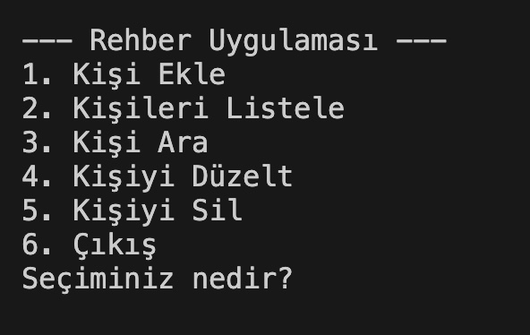
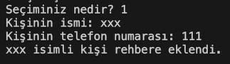
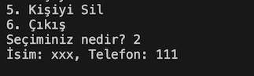
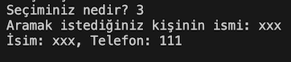
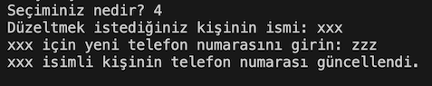

# Rehber Uygulaması

Bu Python tabanlı komut satırı uygulaması, kullanıcıların telefon rehberi oluşturmasına, rehbere kişi eklemesine, kişileri listelemesine, rehberde arama yapmasına, kişileri düzeltmesine ve silmesine olanak tanır. Uygulama, verileri kalıcı hale getirmek için `rehber.txt` dosyasını kullanır.

## Özellikler

- **Kişi Ekleme:** Rehbere yeni bir kişi ekleyebilirsiniz.
- **Kişileri Listeleme:** Rehberdeki tüm kişileri görüntüleyebilirsiniz.
- **Kişi Arama:** Rehberdeki bir kişiyi ismine göre arayabilirsiniz (Büyük/küçük harf duyarlılığı yoktur).
- **Kişiyi Düzeltme:** Rehberdeki bir kişinin telefon numarasını güncelleyebilirsiniz.
- **Kişiyi Silme:** Rehberden bir kişiyi silebilirsiniz.
- **Veri Kaydı:** Tüm veriler `rehber.txt` dosyasında saklanır ve uygulama her çalıştırıldığında bu dosyadan okunur.

## Kurulum

Bu uygulamayı çalıştırmak için aşağıdaki adımları izleyin:

1. Python'u [python.org](https://www.python.org/) üzerinden indirip kurun.
2. Bu depo içerisindeki `rehber.py` dosyasını indirin.
3. Komut satırında, dosyanın bulunduğu klasöre gidin.
4. `python rehber.py` komutunu çalıştırarak uygulamayı başlatın.

## Uygulama Menüsü

Uygulama başlatıldığında aşağıdaki gibi bir menü ile karşılaşırsınız:

Menüden yapabileceğiniz işlemleri seçebilirsiniz.

## Kullanım

1. **Kişi Ekle:** `1` tuşuna basarak yeni bir kişi ekleyebilirsiniz.
   
2. **Kişileri Listele:** `2` tuşuna basarak rehberdeki tüm kişileri listeleyebilirsiniz.
   
3. **Kişi Ara:** `3` tuşuna basarak bir kişinin ismine göre arama yapabilirsiniz.
   
4. **Kişiyi Düzelt:** `4` tuşuna basarak bir kişinin telefon numarasını güncelleyebilirsiniz.
   
5. **Kişiyi Sil:** `5` tuşuna basarak bir kişiyi rehberden silebilirsiniz.
   
6. **Çıkış:** `6` tuşuna basarak uygulamadan çıkabilirsiniz.